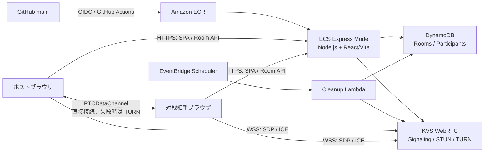
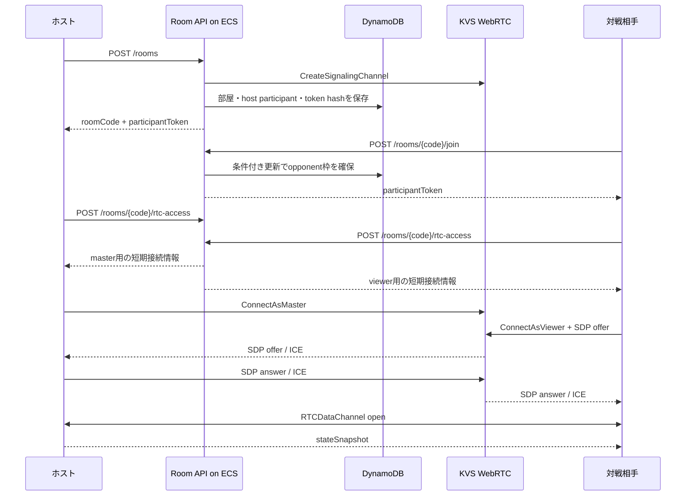
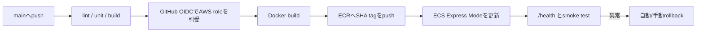

# シンペイ P2P 通信対戦・Amplify 代替デプロイ 技術調査

- 調査日: 2026-08-02
- 対象: `simpei` の React/Vite フロントエンド、オンライン対戦、AWS デプロイ
- 想定リージョン: `ap-northeast-1`（東京）

## 1. 結論

次の構成を第一候補とする。

1. 対局データは WebRTC の `RTCDataChannel` でブラウザ間を直接通信する。
2. ホストを権威ノードとし、対戦相手は「操作要求」だけを送り、ホストが合法手を検証して確定盤面を配信する。
3. WebRTC のシグナリング、STUN、TURN は Amazon Kinesis Video Streams with WebRTC（以下 KVS WebRTC）を利用する。
4. シンペイ本体と部屋管理 REST API は、Node.js の1コンテナにまとめ、Amazon ECS Express Mode（Fargate + Application Load Balancer）で配信する。
5. GitHub Actions がテスト、コンテナビルド、Amazon ECR への push、ECS Express Mode へのデプロイを行う。AWS 認証には GitHub OIDC を使い、長期アクセスキーは置かない。
6. 部屋、参加者、参加トークンのハッシュ、期限は DynamoDB に保存する。対局中の盤面は原則保存しない。
7. インフラは Amplify Gen 2 ではなく AWS CDK / CloudFormation で管理する。

この案では、ECS は「シンペイの配信」「部屋の作成・参加」「KVS チャンネル作成」「短時間だけ有効な接続情報の発行」を担当し、接続確立後の着手・盤面同期は P2P になる。ゲームサーバを常時経由しないため、通信量とサーバ負荷が小さい。

> 重要: Render に近い AWS サービスとして以前は App Runner が候補だったが、2026年現在、AWS App Runner は新規顧客向け提供を終了しており、新機能追加も予定されていない。AWS は移行先として ECS Express Mode を推奨している。そのため、本調査では App Runner を採用しない。

## 2. 現在のリポジトリの状態

調査時点の作業ツリーには、要求にかなり近いオンライン対戦実装がすでに存在する。

| 領域 | 現在の実装 | 評価 |
| --- | --- | --- |
| WebRTC 接続 | `src/online/KvsDataChannelTransport.js` | KVS signaling、STUN/TURN、`RTCDataChannel` を使用済み |
| 通信プロトコル | `src/online/protocol.js` | version、roomId、matchId、sequence、revision を持つ |
| 対局進行 | `src/pages/OnlineRoomPage.jsx` | ホスト権威、準備、再接続猶予、再戦、観戦を実装中 |
| ルール検証 | `src/game/matchSession.js` | 合法手検証後に revision と履歴を更新 |
| 部屋 API | `amplify/functions/room-service/handler.ts` | 作成、参加、heartbeat、参加者検証、RTC 権限発行 |
| 永続化 | Amplify Data / DynamoDB | 部屋と参加者を保存し、対局盤面は保存しない |
| クリーンアップ | Lambda + EventBridge | 期限切れ部屋と KVS channel を削除 |
| 現行 CI/CD | `amplify.yml` | Amplify Hosting と `ampx pipeline-deploy` に依存 |

従って、WebRTC をゼロから作り直す必要はない。既存実装を安定化し、Amplify Data/AppSync への依存を REST API + DynamoDB へ置き換える方が安全である。

なお、オンライン対戦関連のファイルは調査時点で未コミットのものを含むため、正式な基準実装として扱う前にブランチへ保存し、テスト結果を固定する必要がある。

## 3. WebRTC 通信対戦の設計

### 3.1 WebRTC を使う範囲

WebRTC は次の3段階に分かれる。

- Signaling: SDP offer/answer と ICE candidate を交換する。WebRTC 自体は signaling の実装を規定しない。
- NAT traversal: STUN で直接経路を探索し、直接接続できない場合は TURN で中継する。
- Game data: 接続確立後、`RTCDataChannel` でゲームメッセージを送る。

シンペイは音声・映像を必要としないため、MediaStream は使用せず `RTCDataChannel` のみでよい。盤面データは小さく、着手順序が重要なので、現在の `ordered: true` かつ再送回数を制限しない reliable channel が適している。

WebRTC DataChannel は DTLS で暗号化される。ただし、暗号化されていることと相手が正しい参加者であることは別問題である。部屋参加トークン、role、participantId、matchId のアプリケーションレベル検証が必要になる。

### 3.2 推奨アーキテクチャ



ECS コンテナは WebSocket signaling server そのものにはしない。KVS WebRTC が signaling の持続接続と TURN を管理するため、ECS API はステートレスにでき、複数タスクへ安全にスケールできる。

### 3.3 対局開始までの流れ



KVS のモデルは1つの master と複数 viewer の star topology であり、現在の「ホスト = master、対戦相手・観戦者 = viewer」という設計に合う。viewer 同士は直接通信しない。

### 3.4 対局プロトコル

現在の envelope を維持し、最低限次のフィールドを必須とする。

```json
{
  "protocolVersion": 1,
  "roomId": "uuid",
  "matchId": "uuid",
  "type": "actionRequest",
  "senderId": "participant uuid",
  "sequence": 12,
  "revision": 8,
  "payload": {
    "action": { "type": "place", "to": "position-id" }
  }
}
```

推奨メッセージは以下である。

| type | 送信元 | 用途 |
| --- | --- | --- |
| `ready` | host / opponent | 対局開始準備 |
| `actionRequest` | 手番プレイヤー | 着手要求。盤面そのものを送らない |
| `stateSnapshot` | host | revision、盤面、手番、結果、席、再戦状態を配信 |
| `syncRequest` | viewer | revision の欠落、再接続時に再同期を要求 |
| `presence` / `ping` | 全員 | アプリケーションレベルの生存確認 |
| `rematchReady` | host / opponent | 再戦準備 |
| `close` | 全員 | 明示退出。到達は保証しない |

ホスト側の受信手順は固定する。

1. JSON サイズ上限を確認する（例: 32 KiB）。
2. protocolVersion、type、必須フィールドを検証する。
3. roomId と現在の matchId が一致することを確認する。
4. participantId と実際に認証した peer の対応を確認する。
5. role がその type を送れるか確認する。
6. sequence が peer ごとの直前値より大きいことを確認する。
7. actionRequest の revision が現在値と一致することを確認する。
8. `isLegalAction` で合法手を検証する。
9. revision を増やし、完全な snapshot を全 peer へ送る。

盤面が小さいので、差分イベントだけで復元するより毎手 snapshot を送る方が再接続と不整合解消が容易である。履歴が大きくなった場合は、snapshot から全履歴を外すか直近 N 件に制限する。

### 3.5 権威モデルとチート対策

ホスト権威方式はカジュアル対戦向けである。

- 対戦相手による不正着手、連打、古い revision の再送はホストが拒否できる。
- 観戦者は presence/close 以外を送れないようにする。
- 対戦相手はホストが送った snapshot だけを正とする。
- ただし悪意あるホストによる盤面改変や勝敗改変は防げない。

ランキング、賞金、公式レートを導入する場合は、P2P のホストではなくサーバ権威方式へ変更し、全着手を API/WebSocket サーバで検証・保存する必要がある。P2P のまま公平な色決めだけを改善するなら、双方の乱数 commit-reveal が使える。

### 3.6 切断・再接続

次を状態として区別する。

- KVS signaling WebSocket の状態
- `RTCPeerConnection.connectionState`
- `RTCDataChannel.readyState`
- 対局上の presence / heartbeat

signaling が閉じても確立済み DataChannel が直ちに切れるとは限らないため、現在の単一 `connectionState` より分けた方がよい。再接続は指数バックオフ + jitter とし、短い `disconnected` では即敗北にしない。既存の60秒猶予は妥当である。

KVS signaling には最大接続時間1時間、idle timeout 10分がある。長時間の部屋では signaling の再接続を実装し、必要に応じて新しい TURN credentials を取得する。KVS TURN credentials の有効期間は5分なので、再ネゴシエーション時には必ず再取得する。

## 4. KVS WebRTC を採用する理由

### 4.1 選択肢比較

| 方式 | Signaling | STUN/TURN | 長所 | 短所 | 判定 |
| --- | --- | --- | --- | --- | --- |
| KVS WebRTC | AWS managed | AWS managed | 既存コードを活かせる、運用が少ない、IAMで絞れる | master/viewer モデル、quota、AWS固有SDK | **推奨** |
| API Gateway WebSocket + Lambda | 自作 | 別途必要 | serverless、接続数に応じた課金、柔軟 | SDP/ICE routingとconnection管理、TURNが未解決 | 将来候補 |
| ECS + ALB WebSocket | 自作 | coturn等を別途運用 | SPA/API/signalingを1コンテナにまとめられる | 複数タスク間routing、TURN、デプロイ時切断、常時費用 | 初期は非推奨 |
| 外部P2Pサービス | SaaS managed | SaaS managed | 実装が速い | AWS外依存、料金・利用規約 | 要件次第 |

Application Load Balancer 自体は WebSocket を正式にサポートするため、将来自作 signaling server へ移ることは可能である。ただし signaling を自作しても、企業ネットワークや symmetric NAT を越えるための TURN は必要である。coturn を運用する場合は UDP/TCP/TLS、公開IP、帯域、認証情報ローテーション、DDoS対策まで担当範囲になる。

### 4.2 KVS の制約

公式 quota で特に影響するものは次の通りである。

- master: 1 channel あたり1接続
- viewer: デフォルトで1 channel あたり10接続（quota increase の対象）
- signaling connection: 最大1時間
- signaling idle timeout: 10分
- SDP/ICE signaling payload: 10 KiB
- TURN credentials: 有効期間5分
- TURN: 1 allocation あたり最大5 Mbps

対戦相手1名だけなら十分である。現在の「対戦相手1 + 観戦者9」を厳密な上限にすると viewer 10接続になる。quota 引き上げを前提にせず、満員判定を API 側と KVS 側で一致させる。

KVS は active signaling channel 数、signaling message 数、TURN 利用分数で課金される。AWS の料金例では us-east-1 で active channel 1件/月 0.03 USD、100万 signaling messages 2.25 USD、TURN 1,000分 0.12 USD だが、実際の東京リージョン料金はデプロイ前に AWS Pricing Calculator で再計算する。部屋ごとに channel を作る構成では、その月に一度でも接続した部屋数が active channel 数になる。

## 5. 現行 WebRTC 実装で修正すべき点

優先度順に整理する。

### P0: 本番投入前に必要

1. **matchId を受信時に照合する**
   `OnlineRoomPage.jsx` は roomId と sequence は確認するが、現在の matchId との一致確認がない。再戦前の遅延メッセージが新しい対局へ混入し得る。

2. **早着した ICE candidate を落とさない**
   master 側で `RTCPeerConnection` 作成前に ICE candidate が届くと現在は破棄される。KVS JS SDK の `enableEarlyIceCandidateBuffering` を有効にし、`setRemoteDescription` 後に `drainPendingIceCandidates()` を呼ぶ。

3. **master では clientId を指定しない**
   KVS JS SDK の設定では clientId は viewer に必要で、master には渡さない。現在の transport は role に関係なく渡している。

4. **host 側にも signaling 再接続を実装する**
   現在の自動再試行は viewer のみである。最大1時間、idle timeout、ネットワーク変更に備え、host も再試行する。

5. **未認証 peer を明示的に切断する**
   `verifyRoomPeer` に失敗した peer は無視するだけでなく、その DataChannel と PeerConnection を閉じる。接続枠とメモリを消費させない。

6. **参加者認証前のメッセージを制限する**
   peerId の文字列 prefix を role 判定の根拠にしない。DynamoDB の participant と照合した role だけを利用する。

7. **接続状態を分離する**
   signaling close、PeerConnection disconnected、DataChannel close を別状態にし、DataChannel が生きている間に対局を不要に停止しない。

### P1: 安定運用に必要

1. `syncRequest` を追加し、revision の飛びを検出した viewer が snapshot を要求できるようにする。
2. `bufferedAmount` を監視し、snapshot の過剰送信時に backpressure をかける。
3. `iceconnectionstatechange` と `restartIce()` / ICE restart の方針を追加する。
4. signaling 再接続を exponential backoff + jitter にする。固定3秒の無限再試行は避ける。
5. cleanup Lambda の DynamoDB `Scan` を pagination 対応にする。規模拡大時は status/expiry 用 sparse GSI を `Query` する。
6. DynamoDB TTL を最終的な安全網として有効にする。ただし TTL 削除は即時ではないため、KVS channel の即時削除は1分間隔 cleanup を継続する。
7. ブラウザへ1時間の STS credentials を返す代わりに、バックエンドで KVS WSS URL を署名し、ICE server 設定と一緒に短時間だけ返す方式を検討する。KVS JS SDK の custom request signer はこの用途を想定している。

## 6. Amplify 代替デプロイの調査

### 6.1 候補比較

| 候補 | GitHub push からの自動デプロイ | SPA配信 | REST API | WebSocket | 運用負荷 | 小規模時コスト | 評価 |
| --- | --- | --- | --- | --- | --- | --- | --- |
| **ECS Express Mode + GitHub Actions** | 可能 | 可能 | 可能 | ALBが対応 | 中 | ALB + 最低1 taskが常時課金 | **Renderに近い中心案** |
| S3 + CloudFront + API Gateway/Lambda | Actions/CodePipelineで可能 | 最適 | 可能 | API Gatewayで可能 | 中 | 低くしやすい | コスト優先案 |
| 通常の ECS Fargate + ALB | Actions/CodePipelineで可能 | 可能 | 可能 | 対応 | 高 | Express Modeと同種 | 高度な制御が必要な場合 |
| Elastic Beanstalk | Actions等で可能 | 可能 | 可能 | ALB構成で対応 | 中 | EC2/ALB常時課金 | 新規採用の優先度は低い |
| App Runner | GitHub直結 | 可能 | 可能 | 長時間接続に不向き | 低 | 常時memory課金 | **新規顧客利用不可のため不採用** |

低アクセスで費用最小化が最優先なら、S3 + CloudFront で SPA を配信し、API Gateway HTTP API + Lambda + DynamoDB で部屋 API を作る構成が有利である。一方、「1つのWebサービスをGitHubからデプロイし、フロントとAPIを同居させる」という Render に近い体験は ECS Express Mode が適している。

### 6.2 ECS Express Mode が作るもの

ECS Express Mode はコンテナイメージとIAMロールを指定すると、主に次を作成・管理する。

- ECS Service / Fargate task
- Application Load Balancer、HTTPS listener、target group、health check
- auto scaling
- security group と network 設定
- CloudWatch Logs
- canary deployment と異常時 rollback 用 alarm
- デフォルトの `https://<service>.ecs.<region>.on.aws/` URL

Express Mode 自体の追加料金はなく、Fargate、ALB、ECR、CloudWatch、public IPv4、data transfer 等の基盤リソースに課金される。小規模サービスでは ALB の固定時間料金が支配的になりやすい。費用だけで決めず、運用の単純さとのトレードオフで選ぶ。

### 6.3 コンテナ構成

1つの Node.js アプリとして以下を公開する。

```text
GET  /health                     -> 200 OK
GET  /api/rooms                  -> 公開部屋一覧
POST /api/rooms                  -> 部屋作成
POST /api/rooms/:code/join       -> 参加
POST /api/rooms/:code/heartbeat  -> host heartbeat
POST /api/rooms/:code/rtc-access -> KVS短期接続情報
POST /api/rooms/:code/leave      -> 退出/終了
GET  /*                           -> Vite build済みSPA（history fallback）
```

Docker は multi-stage build とし、build stage で `npm ci && npm test && npm run build`、runtime stage には production dependency、Node server、`dist/` だけを含める。イメージタグは `latest` だけでなく Git commit SHA を必ず付け、rollback できるようにする。

ECS task role には DynamoDB と KVS の必要 action のみを許可する。KVS 接続情報を STS で発行する場合は、AssumeRole 先の policy と session policy の共通部分で、対象 room channel ARN と MASTER/VIEWER role を制限する。

### 6.4 GitHub 連携

GitHub Actions の流れは次の通りとする。



GitHub repository secret に AWS access key/secret key を保存しない。AWS IAM に GitHub OIDC provider とデプロイ用 role を作り、trust policy の `sub` 条件を対象 organization/repository/branch または GitHub Environment に限定する。

環境は最低でも `development` と `production` を別 ECS service、別 DynamoDB table、別 IAM role にする。production は GitHub Environment の承認ルールと branch protection を設定する。

## 7. Amplify からの移行計画

### Phase 0: 現状を固定

- オンライン対戦の作業をブランチへ保存する。
- `npm test`、`npm run lint`、`npm run build`、Playwright を CI で成功させる。
- 現行 Amplify の Cognito、Storage、Notes 等、部屋以外の永続データを棚卸しする。

### Phase 1: WebRTC 実装を安定化

- 第5章の P0 を修正する。
- 同一LANだけでなく、スマートフォン回線対固定回線、企業/VPN相当、TURN only で試験する。
- CloudWatch で KVS signaling failures と TURN connected minutes を監視する。

この段階は一時的に Amplify backend のままでもよい。通信部分とホスティング移行を同時に壊さないためである。

### Phase 2: Amplify client を抽象化

- `roomClient.js` の外側に `RoomApi` interface を置く。
- AppSync/Amplify 実装と REST 実装を切り替え可能にする。
- ロビーの AppSync subscription は、最初は5秒程度の polling に置き換える。リアルタイム性が必要になってから API Gateway WebSocket/SSE を検討する。

### Phase 3: AWS CDK で直接プロビジョニング

- DynamoDB Rooms / Participants / HostLeases
- cleanup Lambda + EventBridge Scheduler
- KVS / STS / IAM policies
- ECR
- ECS Express Mode に必要な role、GitHub OIDC deploy role
- 必要なら Route 53 / ACM / WAF

Amplify が生成した table 名や output JSON を参照せず、環境変数で table 名、region、許可 origin 等を注入する。

### Phase 4: ECSへ並行デプロイ

- Node API と Vite SPA をコンテナ化する。
- GitHub Actions で ECR + ECS Express Mode にデプロイする。
- ECS の一時URLで E2E試験する。
- production domain を Route 53 の weighted record で Amplify 90 / ECS 10 から段階移行する。
- エラー率、部屋作成成功率、P2P接続成功率、TURN利用率を確認し、100%へ移す。

### Phase 5: Amplifyを停止

- 1〜2週間程度の安定運用後に Amplify Hosting の build を停止する。
- 永続データの移行を確認してから Amplify backend resource を削除する。
- `amplify.yml`、`ampx` devDependencies、`aws-amplify/data` 依存、`amplify_outputs.json` 読み込みを削除する。
- 削除前に CloudFormation stack、DynamoDB table、S3 bucket、Cognito user pool/identity pool の retained/deletion policy を必ず確認する。

部屋と対局は短命なので原則データ移行不要だが、認証ユーザー、ノート、画像等は別扱いである。Amplify stack を先に削除してはいけない。

## 8. セキュリティ要件

### API / 部屋管理

- 部屋コードは識別子であり秘密情報として扱わない。
- 参加トークンは256 bit以上の乱数にし、DynamoDBにはSHA-256 hashのみ保存する。
- ブラウザでは `sessionStorage` または Secure + HttpOnly + SameSite cookie を使う。
- create/join/rtc-access に rate limit を設定し、必要に応じて ALB に AWS WAF を関連付ける。
- 表示名、room code、すべてのJSON payloadをサーバでも検証する。
- DynamoDB の opponent 枠取得、人数上限、host lease は conditional write を使う。

### AWS権限

- ECS task role、cleanup Lambda role、GitHub deploy role を分ける。
- browser に恒久 AWS credentials を埋め込まない。
- 一時 STS credentials を返すなら、対象 channel ARN、MASTER/VIEWER、短い有効期限に絞る。
- より安全にする場合は ECS が KVS signaling WSS URL を pre-sign し、browser には署名済みURLと短期 TURN config だけを返す。
- GitHub Actions は OIDC を使い、trust policy で repository と branch/environment を固定する。

### P2P固有

- `RTCDataChannel` の暗号化だけに認証を依存しない。
- 相手が送った senderId / role / revision を信用しない。
- ICE candidate によりネットワーク情報が相手へ見える可能性を利用規約・プライバシー方針で考慮する。IP秘匿を優先するモードでは `iceTransportPolicy: "relay"` を選べるようにするが、TURN費用と遅延が増える。
- host-authoritative では悪意あるhostを防げないことを仕様として明示する。

## 9. テスト計画

### 自動テスト

- protocol schema、role/type matrix、sequence、revision、matchId の unit test
- 同時 join 時に opponent が1人だけになる DynamoDB conditional write test
- 違法手、手番違い、古い revision、別 room/match の拒否テスト
- snapshot からの再同期、再戦後の旧メッセージ拒否テスト
- cleanup の pagination、条件付き削除、KVS channel 不在時の冪等性テスト
- Playwright で host/opponent/spectator の3 context を使う E2E
- コンテナの `/health` と SPA history fallback の smoke test

### 実ネットワーク試験

- 同一LAN
- 異なる固定回線
- PC固定回線 + スマートフォン4G/5G
- VPN利用中
- TURN only
- タブ再読み込み、Wi-Fi/モバイル切替、30〜60秒オフライン
- 1時間を超える部屋
- ECS deployment 中にロビー/APIが継続し、既存 P2P 対局が影響を受けないこと

P2P はローカル自動テストだけでは NAT/TURN の問題を検出できない。少なくとも2種類の外部ネットワークを release gate に含める。

## 10. 監視指標

- Room API: request count、4xx/5xx、p95 latency
- 部屋: 作成数、join成功率、期限切れ数、cleanup失敗数
- WebRTC: signaling接続成功率、接続確立時間、direct/TURN比率、再接続成功率
- ゲーム: revision不一致数、不正message拒否数、切断による不戦勝数
- ECS: deployment failure、task restart、CPU/memory、ALB target response time
- KVS: signaling Failure、Latency、MessagesTransferred、TURNConnectedMinutes

ブラウザ側 `RTCPeerConnection.getStats()` から selected candidate pair と round-trip time を匿名化して収集すると、TURN依存や特定ネットワークでの失敗を判断しやすい。

## 11. 実装優先順位

| 優先度 | 作業 | 完了条件 |
| --- | --- | --- |
| 1 | 現行WebRTCのP0修正 | 異なる2回線で対局・再接続・再戦が成功 |
| 2 | `RoomApi` 抽象化とREST API | Amplify clientなしで部屋作成/参加が可能 |
| 3 | CDKによるDynamoDB/KVS/IAM/cleanup | 新規AWS環境を再現可能 |
| 4 | Docker + ECS Express Mode | ECS URLでSPA/API/P2P対局が動作 |
| 5 | GitHub Actions OIDC deploy | main pushからテスト付き自動deploy・rollback可能 |
| 6 | weighted cutover | Amplifyへ戻せる状態で本番トラフィック移行 |
| 7 | Amplify除去 | Hosting、AppSync generated client、ampx依存を削除 |

## 12. 採用判断

### 採用する

- WebRTC `RTCDataChannel`
- KVS WebRTC signaling/STUN/TURN
- host-authoritative + full snapshot
- DynamoDB conditional write
- ECS Express Mode + ECR
- GitHub Actions + OIDC
- CDK / CloudFormation

### 初期リリースでは採用しない

- 自前 signaling WebSocket server
- 自前 coturn
- P2P mesh
- host migration
- server-authoritative ranked match
- 対局全履歴の永続化

## 13. 公式資料

### WebRTC / KVS

- [W3C WebRTC: Peer-to-peer Data API](https://www.w3.org/TR/webrtc/#peer-to-peer-data-api)
- [MDN: Using WebRTC data channels](https://developer.mozilla.org/en-US/docs/Web/API/WebRTC_API/Using_data_channels)
- [AWS: Kinesis Video Streams with WebRTC - How it works](https://docs.aws.amazon.com/kinesisvideostreams-webrtc-dg/latest/devguide/kvswebrtc-how-it-works.html)
- [AWS: KVS WebRTC service quotas](https://docs.aws.amazon.com/kinesisvideostreams-webrtc-dg/latest/devguide/kvswebrtc-limits.html)
- [AWS: KVS WebRTC JavaScript SDK](https://docs.aws.amazon.com/kinesisvideostreams-webrtc-dg/latest/devguide/kvswebrtc-sdk-js.html)
- [AWS Labs: amazon-kinesis-video-streams-webrtc-sdk-js](https://github.com/awslabs/amazon-kinesis-video-streams-webrtc-sdk-js)
- [AWS: Kinesis Video Streams pricing](https://aws.amazon.com/kinesis/video-streams/pricing/)

### デプロイ / AWS

- [AWS: App Runner availability change](https://docs.aws.amazon.com/apprunner/latest/dg/apprunner-availability-change.html)
- [AWS: ECS Express Modeが作成するリソース](https://docs.aws.amazon.com/AmazonECS/latest/developerguide/express-service-work.html)
- [AWS: ECS Express Mode getting started](https://docs.aws.amazon.com/AmazonECS/latest/developerguide/express-service-getting-started.html)
- [AWS: ECS Express Mode update / canary deployment](https://docs.aws.amazon.com/AmazonECS/latest/developerguide/express-service-update-full.html)
- [AWS: Application Load Balancer WebSocket support](https://docs.aws.amazon.com/elasticloadbalancing/latest/application/load-balancer-listeners.html#websockets)
- [AWS: API Gateway WebSocket APIs](https://docs.aws.amazon.com/apigateway/latest/developerguide/apigateway-websocket-api.html)
- [GitHub: AWS向けOIDC設定](https://docs.github.com/en/actions/how-tos/secure-your-work/security-harden-deployments/oidc-in-aws)
- [AWS: DynamoDB expired items / TTL](https://docs.aws.amazon.com/amazondynamodb/latest/developerguide/ttl-expired-items.html)
- [AWS: Fargate pricing](https://aws.amazon.com/fargate/pricing/)
- [AWS: Elastic Load Balancing pricing](https://aws.amazon.com/elasticloadbalancing/pricing/)

## 14. 最終提案

最もリスクが低い進め方は、現在作られている KVS WebRTC + DataChannel の実装を先に安定化し、その後で Amplify Data/AppSync を REST API に置き換え、最後に ECS Express Mode へ配信先を切り替える順序である。

「独自 signaling server も同じコンテナに載せる」構成は ECS + ALB で実現できるが、KVS を捨てると TURN 運用が新たに必要になる。シンペイの通信量では自前化による利益が小さいため、初期版は KVS を managed signaling/TURN として利用する方がよい。
